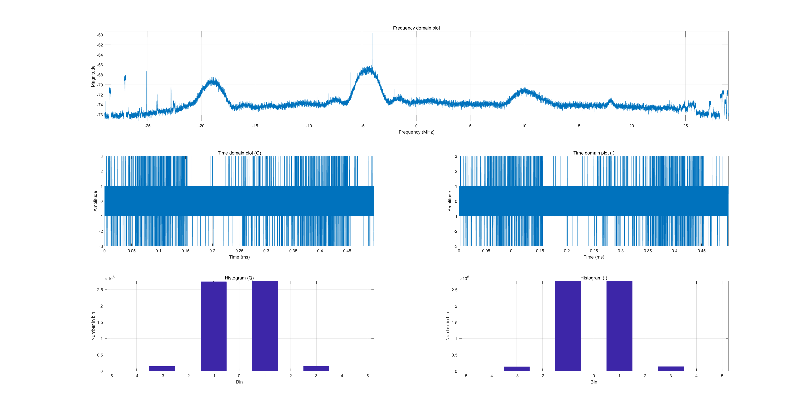
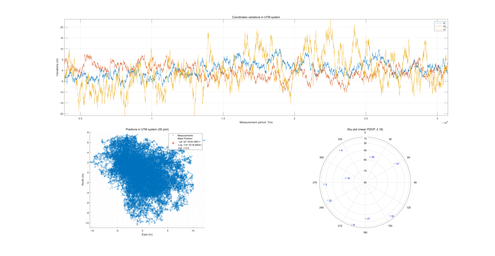

# AAE6102-Assignment-1
## Satellite Communication and Navigation (2024/25 Semester 2) - YANG Xiaoyu(24145927r)

## Task 1 – Acquisition
The GPS signal acquisition process is structured into three distinct phases: initialization, initial acquisition, and precision refinement.

The result figures are shown as follows,

| 左图 | 右图 |
|------|------|
|  |  |
|  |  |

