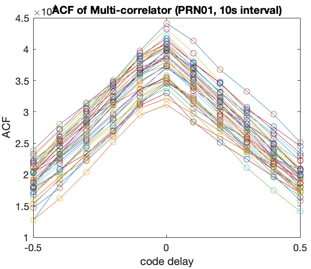
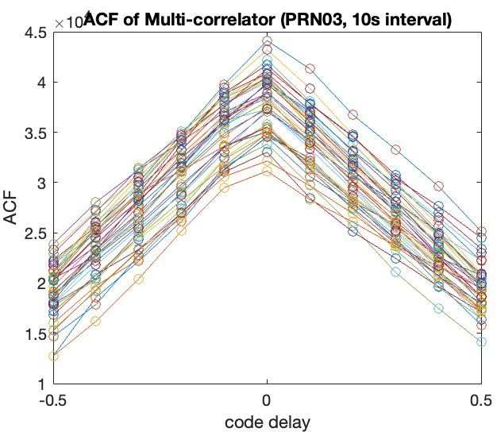

# AAE6102-Assignment-1
## Satellite Communication and Navigation (2024/25 Semester 2) - YANG Xiaoyu(24145927r)

## Task 1: Acquisition
The GPS signal acquisition process is structured into three distinct phases: initialization, initial acquisition, and precision refinement.

The result figures are shown as follows,

| Open Sky | Urban |
|:--------:|:-----:|
|    **Fig1:** Open Sky Acquisition Result|    **Fig2:** Urban Acquisition Result|
|    **Fig3:** In open sky dataset, satellite 16,22,26,27,31 can be acquired|    **Fig4:** In urban dataset, satellite 1,3,11,18 can be acquired|

## Task 2: Tracking
### 2.1 Open Sky

|          |       |
|:--------:|:-----:|
|    **Fig5:** Open Sky: Channel-1 PRN-16 |    **Fig6:** Open Sky: Channel-2 PRN-26|
|  **Fig7:** Open Sky: Channe5-1 PRN-27 |  **Fig8:** Open Sky: Channel-3 PRN-31 | 

Figures 5 to 8 present multiple graphs showing the tracking results for different satellites (PRN16, PRN26, PRN27, and PRN31) in an open sky environment. The performance of each satellite is visualized through six different types of plots:

- Discrete-Time Scatter Plot
The I/Q constellation diagrams for each satellite clearly illustrate the signal phase distribution. The dense and symmetric distribution of points indicates good signal quality and high demodulation stability.
- Navigation Message Bits
Each graph displays the navigation bit sequences for the satellites. The bit plots show clear high and low transitions, reflecting reliable signal demodulation without noticeable data interruptions.
- Raw PLL Discriminator Output
The raw PLL discriminator outputs show signal fluctuations over time, with stable overall amplitudes. This indicates effective phase tracking performance.
- Correlation Results 
The correlation results show the Early, Prompt, and Late correlation branches. The three curves are clearly separated, with the Prompt branch showing significantly higher amplitude than the other two. This confirms good signal acquisition and tracking performance.
- Raw DLL Discriminator Output
The raw DLL discriminator outputs exhibit some noise over time, but the amplitude variations are within expected ranges, demonstrating sufficient code tracking capability.
- Filtered DLL Discriminator Output
The filtered DLL outputs are smoother compared to the raw outputs. Noise is significantly reduced, and amplitude fluctuations are minimized, indicating the effectiveness of the filtering process in improving code tracking quality.

The signals from satellites PRN16,  PRN26, PRN27, and PRN31 perform well under open sky conditions. The DLL and PLL tracking results exhibit stable performance, with filtered outputs improving overall signal stability and reliability. These results demonstrate the excellent performance of the signal processing system in open sky environments.

<!-- |          |       |
|:--------:|:-----:|
|  | |
|  | | -->

### 2.2 Urban
|          |       |
|:--------:|:-----:|
|  **Fig9:** Open Sky: Channel-1 PRN-1|  **Fig10:** Open Sky: Channel-1 PRN-3|
|  **Fig11:** Open Sky: Channel-1 PRN-11 |  **Fig12:** Open Sky: Channel-4 PRN-18|

Analysis of Figures 9 to 12: Urban Environment Results
Compared to open sky, the urban tracking results show notable challenges:
- Scatter Plots: More compact constellations indicate stronger but constrained signals due to multipath effects.
- DLL Outputs: Higher amplitude variations and irregular patterns reflect multipath and signal reflections.
- PLL Outputs: Showing phase tracking issues from obstructions.
- Correlation Results: Greater variability and larger amplitude ranges highlight inconsistent signal tracking.

Urban environments increase signal variability and tracking instability, with PRN11 and PRN18 showing significant degradation due to multipath and obstructions.

<!-- |  |  |
|:--------:|:-----:|
|  | |
|  | | -->

### 2.3 Impact of Urban Interference
- Multipath Effects: Reflected signals cause constructive and destructive interference, leading to distorted correlation peaks.
- NLOS Receptions: Signals arriving via indirect paths introduce biases in the pseudorange measurements.
- Signal Attenuation: Buildings and other structures can attenuate the signal, reducing the signal-to-noise ratio (SNR) for satellites of Channel 3 and Channel 4.

### 2.4 Discussion
- In the open-sky environment, the DLL performs well with clear correlation peaks, allowing for accurate tracking.
- In the urban environment, the DLL performance degrades due to interference, resulting in less accurate and less stable tracking.
- Multiple correlators help in maintaining lock by providing a more robust estimate of the signal phase.

## Task 3: Navigation Data Decoding

## Task 4: Position and velocity estimation
### 4.1 Open Sky

    
       
    <strong>Fig. WSL-sky-enu.png</strong>

|  |  |
|:--------:|:-----:|
|    Fig1: Open Sky Acquisition Result|    Fig2: Urban Acquisition Result|

### 4.2 Urban

    
       
    <strong>Fig. WSL-urban-enu</strong>

|  |  |
|:--------:|:-----:|
|    Fig1: Open Sky Acquisition Result|    Fig2: Urban Acquisition Result|

## Task 5: Kalman-filter based positioning and velociy
### 5.1 Open Sky

    
       
    <strong>Fig. EKF-sky-enu</strong>

|  |  |
|:--------:|:-----:|
|    Fig1: Open Sky Acquisition Result|    Fig2: Urban Acquisition Result|

### 5.2 Urban

    
       
    <strong>Fig. EKF-urban-enu</strong>

|  |  |
|:--------:|:-----:|
|    Fig1: Open Sky Acquisition Result|    Fig2: Urban Acquisition Result|
