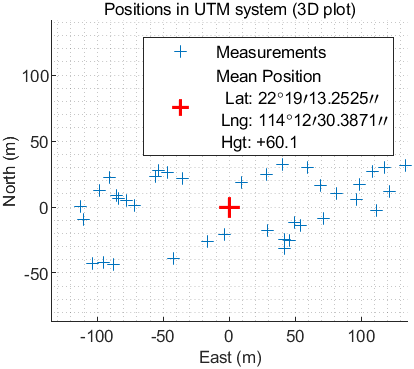

# AAE6102-Assignment-1

**Author:** YANG Xiaoyu

**Student ID:** 24145927r

## Task 1: Acquisition
The results of data acquisition are shown in Figures 1 to 4:

- **Open Sky Dataset**
As shown in Figures 1 and 3, satellites with PRN numbers 16, 22, 26, 27, and 31 can be successfully acquired in the open sky environment. These satellites have clear acquisition metrics above the threshold, indicating strong signal reception.
- **Urban Dataset**
Figures 2 and 4 demonstrate that, in the urban environment, satellites with PRN numbers 1, 3, 11, and 18 can be acquired. Due to urban interference, fewer satellites are successfully acquired compared to the open sky environment, and the acquisition metrics for these satellites are generally lower.

| Open Sky | Urban |
|:--------:|:-----:|
|    **Fig1:** Open Sky Acquisition Result|    **Fig2:** Urban Acquisition Result|
|    **Fig3:** In open sky dataset, satellite 16,22,26,27,31 can be acquired|    **Fig4:** In urban dataset, satellite 1,3,11,18 can be acquired|

## Task 2: Tracking
#### 2.1 Open Sky

|          |       |
|:--------:|:-----:|
|    **Fig5:** Open Sky: Channel-1 PRN-16 |    **Fig6:** Open Sky: Channel-2 PRN-26|
|  **Fig7:** Open Sky: Channe5-1 PRN-27 |  **Fig8:** Open Sky: Channel-3 PRN-31 | 

Figures 5 to 8 illustrate the tracking results for satellites (PRN16, PRN26, PRN27, and PRN31) in an open sky environment:

- Scatter Plots: Dense and symmetric I/Q constellations indicate good signal quality and stable demodulation.
- Navigation Bits: Clear high/low transitions demonstrate reliable signal decoding without interruptions.
- Raw PLL Outputs: Stable amplitudes reflect effective phase tracking.
- Correlation Results: Well-separated Early, Prompt, and Late branches confirm strong signal acquisition.
- Raw DLL Outputs: Some noise is present, but amplitude variations remain within expected ranges.
- Filtered DLL Outputs: Smoother signals with reduced noise and fluctuations highlight effective filtering.

Overall, PRN16, PRN26, PRN27, and PRN31 exhibit excellent performance in open sky conditions, with stable DLL and PLL tracking and reliable signal processing.

<!-- |          |       |
|:--------:|:-----:|
|  | |
|  | | -->

#### 2.2 Urban
|          |       |
|:--------:|:-----:|
|  **Fig9:** Open Sky: Channel-1 PRN-1|  **Fig10:** Open Sky: Channel-1 PRN-3|
|  **Fig11:** Open Sky: Channel-1 PRN-11 |  **Fig12:** Open Sky: Channel-4 PRN-18|

Analysis of Figures 9 to 12: Urban Environment Results
Compared to open sky, the urban tracking results show notable challenges:
- Scatter Plots: More compact constellations indicate stronger but constrained signals due to multipath effects.
- DLL Outputs: Higher amplitude variations and irregular patterns reflect multipath and signal reflections.
- PLL Outputs: Showing phase tracking issues from obstructions.
- Correlation Results: Greater variability and larger amplitude ranges highlight inconsistent signal tracking.

Urban environments increase signal variability and tracking instability, with PRN11 and PRN18 showing significant degradation due to multipath and obstructions.

#### 2.3 ACF

| Open Sky | Urban |
|:--------:|:-----:|
|   **Fig13:** Open Sky: Correlation Results with Multi-correlator|  **Fig14:** Urban: Correlation Results with Multi-correlator |

Figures 13 and 14 compare the ACF results from multiple correlators for satellites tracked in open sky (Fig. 13) and urban (Fig. 14) environments. Key observations include:

- **ACF Magnitudes:**
ACF values in urban areas are significantly smaller than in open sky, reflecting the higher interference and signal attenuation in urban environments.
Open sky signals benefit from minimal propagation interference, leading to higher ACF peaks.

- **ACF Variations:**
Urban ACF values exhibit smaller variations, likely due to the improved quality of the antenna and receiver used in the urban experiment. This ensures more consistent signal reception despite the challenging environment.

Urban environments reduce ACF peak amplitudes due to interference but result in more consistent ACF values, likely due to better equipment used for signal reception.

#### 2.4 Impact of Urban Interference
Urban environments significantly affect signal quality and tracking performance due to several factors:

- **Multipath Effects:** Reflected signals cause constructive and destructive interference, distorting correlation peaks.
- **NLOS Receptions:** Indirect signal paths introduce biases in pseudorange measurements, reducing accuracy.
- **Signal Attenuation:** Buildings and structures attenuate signals, lowering the signal-to-noise ratio (SNR).

In contrast, open-sky environments allow the Delay-Locked Loop (DLL) to perform reliably, with clear correlation peaks enabling accurate and stable tracking. However, in urban settings, DLL performance degrades due to interference, resulting in reduced tracking accuracy and stability. The use of multiple correlators helps mitigate these challenges by providing more robust signal phase estimates, maintaining signal lock even in challenging conditions.

## Task 3: Navigation Data Decoding
#### 3.1 GPS Satellite Ephemeris Data for Open Sky Dataset (PRN 16, 26, 27, 31)
| Parameter      | Description | PRN 16       | PRN 26       | PRN 27       | PRN 31       |
|----------------|-------------|--------------|--------------|--------------|--------------|
| **TOW**       | Time of Week (s) | 390108, ... | 390108, ... | 390108, ... | 390108, ... |
| **weeknum**    | GPS Week Number | 1155         | 1155         | 1155         | 1155         |
| **IODC**       | Issue of Data Clock | 9          | 113         | 30          | 83          |
| **TGD**        | Time Group Delay (s) | -1.024e-08  | 6.984e-09   | 1.862e-09   | -1.303e-08  |
| **toc**        | Clock Data Reference Time (s) | 396000      | 396000      | 396000      | 396000      |
| **af2**        | Clock Drift Rate (s/s²) | 0            | 0            | 0            | 0            |
| **af1**        | Clock Drift (s/s) | -6.366e-12   | 3.979e-12    | -5.002e-12   | -1.932e-12   |
| **af0**        | Clock Bias (s) | -0.0004069   | 0.0001448    | -0.0002061   | -0.0001448   |
| **Crs**        | Sine Harmonic Correction Term to Orbit Radius (m) | 23.34      | 21.25       | 70.43       | 30.71       |
| **deltan**     | Mean Motion Difference (rad/s) | 4.246e-09   | 5.051e-09    | 4.030e-09    | 4.807e-09    |
| **M0**         | Mean Anomaly at Reference Time (rad) | 0.7181    | 1.7355      | -0.1730     | 2.8245      |
| **Cuc**        | Cosine Harmonic Correction to Argument of Latitude (rad) | 1.389e-06 | 1.152e-06  | 3.730e-06  | 1.460e-06  |
| **ecc**        | Eccentricity | 0.0122        | 0.0062        | 0.0095       | 0.0102       |
| **Cus**        | Sine Harmonic Correction to Argument of Latitude (rad) | 7.687e-06 | 7.040e-06  | 8.242e-06  | 7.228e-06  |
| **sqrta**      | Square Root of Semi-Major Axis (m^1/2) | 5153.771   | 5153.636    | 5153.652    | 5153.622    |
| **toe**        | Time of Ephemeris (s) | 396000      | 396000      | 396000      | 396000      |
| **Cic**        | Cosine Harmonic Correction to Inclination (rad) | -1.005e-07 | -2.048e-08 | 1.080e-07  | -1.136e-07 |
| **omegae**     | Longitude of Ascending Node (rad) | -1.674     | -1.812      | -0.717      | -2.787      |

#### 3.2 GPS Satellite Ephemeris Data for Urban Dataset (PRN 1, 3, 7, 11)
| Parameter      | Description | PRN 1        | PRN 3        | PRN 7        | PRN 11       |
|----------------|-------------|--------------|--------------|--------------|--------------|
| **TOW**       | Time of Week (s) | 449358, ... | 449358, ... | 449358, ... | 449358, ... |
| **weeknum**    | GPS Week Number | 1032         | 1032         | 1032         | 1032         |
| **IODC**       | Issue of Data Clock | 72          | 72          | 33          | 83          |
| **TGD**        | Time Group Delay (s) | 5.587e-09   | 1.862e-09   | -1.117e-08  | -1.257e-08  |
| **toc**        | Clock Data Reference Time (s) | 453600      | 453600      | 453600      | 453600      |
| **af2**        | Clock Drift Rate (s/s²) | 0            | 0            | 0            | 0            |
| **af1**        | Clock Drift (s/s) | -9.436e-12   | -1.136e-12   | -7.617e-12   | 8.526e-12    |
| **af0**        | Clock Bias (s) | -3.489e-05   | 0.0001863    | -3.951e-05   | -0.0005900   |
| **Crs**        | Sine Harmonic Correction Term to Orbit Radius (m) | -120.71    | -62.09      | 6.46        | -67.12      |
| **deltan**     | Mean Motion Difference (rad/s) | 4.190e-09   | 4.447e-09   | 4.891e-09   | 5.890e-09   |
| **M0**         | Mean Anomaly at Reference Time (rad) | 0.5179    | -0.4303     | -0.0807     | -0.1989     |
| **Cuc**        | Cosine Harmonic Correction to Argument of Latitude (rad) | -6.334e-06 | -3.090e-06 | 3.091e-07  | -3.604e-06 |
| **ecc**        | Eccentricity | 0.008923      | 0.002226     | 0.012823     | 0.016643     |
| **Cus**        | Sine Harmonic Correction to Argument of Latitude (rad) | 5.301e-06 | 1.155e-05  | 8.014e-06  | 1.512e-06  |
| **sqrta**      | Square Root of Semi-Major Axis (m^1/2) | 5153.655   | 5153.777    | 5153.742    | 5153.706    |
| **toe**        | Time of Ephemeris (s) | 453600      | 453600      | 453600      | 453600      |
| **Cic**        | Cosine Harmonic Correction to Inclination (rad) | -7.450e-08 | 1.117e-08  | 4.284e-08  | -3.166e-07 |
| **omegae**     | Longitude of Ascending Node (rad) | -3.106     | -2.064      | 0.04408     | 2.725       |

## Task 4: Position and velocity estimation
#### 4.1 Open Sky

    
       
    <strong>Fig. WSL-sky-enu.png</strong>

|  |  |
|:--------:|:-----:|
|    Fig1: Open Sky Acquisition Result|    Fig2: Urban Acquisition Result|

#### 4.2 Urban

    
       
    <strong>Fig. WSL-urban-enu</strong>

|  |  |
|:--------:|:-----:|
|    Fig1: Open Sky Acquisition Result|    Fig2: Urban Acquisition Result|

## Task 5: Kalman-filter based positioning and velociy
#### 5.1 Open Sky

    
       
    <strong>Fig. EKF-sky-enu</strong>

|  |  |
|:--------:|:-----:|
|    Fig1: Open Sky Acquisition Result|    Fig2: Urban Acquisition Result|

#### 5.2 Urban

    
       
    <strong>Fig. EKF-urban-enu</strong>

|  |  |
|:--------:|:-----:|
|    Fig1: Open Sky Acquisition Result|    Fig2: Urban Acquisition Result|
