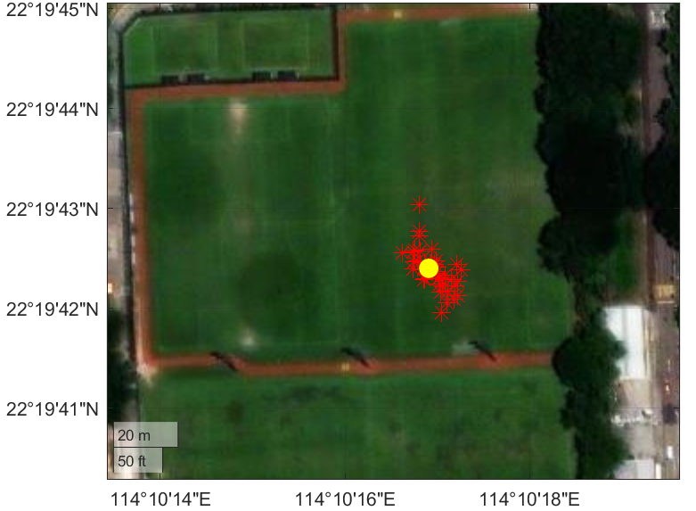
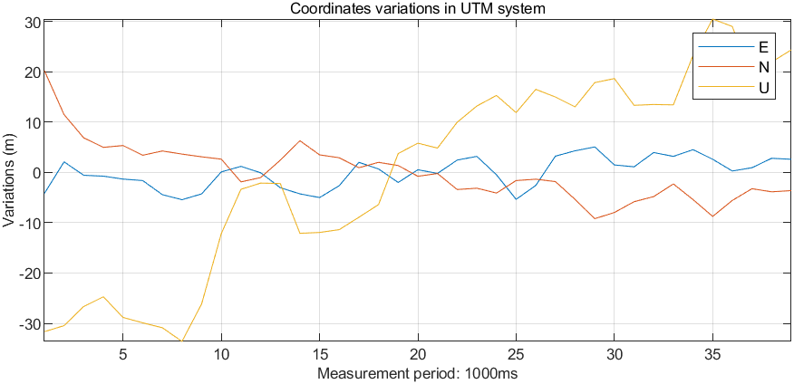
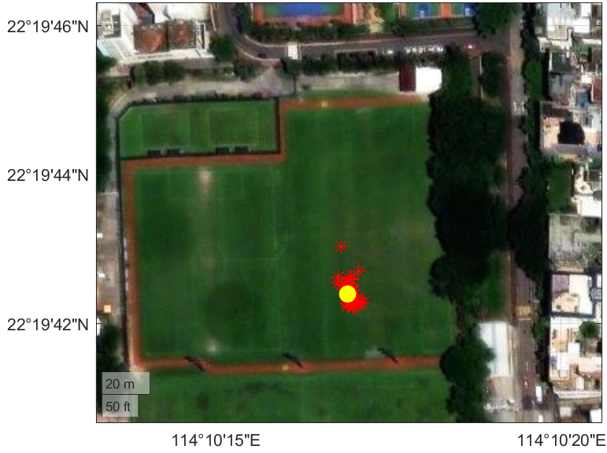

# AAE6102-Assignment-1
## Satellite Communication and Navigation (2024/25 Semester 2) - YANG Xiaoyu(24145927r)

## Task 1: Acquisition
The GPS signal acquisition process is structured into three distinct phases: initialization, initial acquisition, and precision refinement.

The result figures are shown as follows,

| Open Sky | Urban |
|:--------:|:-----:|
|    Fig1: Open Sky Acquisition Result|    Fig2: Urban Acquisition Result|
|    Fig3: In open sky dataset, satellite 16,22,26,27,31 can be acquired|    Fig4: In urban dataset, satellite 1,3,11,18 can be acquired|

## Task 2: Tracking

## Task 3: Navigation Data Decoding

## Task 4: Position and velocity estimation
### Open Sky

    
       
    <strong>Fig. WSL-sky-enu.png</strong>

|  |  |
|:--------:|:-----:|
|    Fig1: Open Sky Acquisition Result|    Fig2: Urban Acquisition Result|

### Urban

    
       
    <strong>Fig. WSL-urban-enu</strong>

|  |  |
|:--------:|:-----:|
|    Fig1: Open Sky Acquisition Result|    Fig2: Urban Acquisition Result|

## Task 5: Kalman-filter based positioning and velociy
### Open Sky

    
       
    <strong>Fig. EKF-sky-enu</strong>

|  |  |
|:--------:|:-----:|
|    Fig1: Open Sky Acquisition Result|    Fig2: Urban Acquisition Result|

### Urban

    
       
    <strong>Fig. EKF-urban-enu</strong>

|  |  |
|:--------:|:-----:|
|    Fig1: Open Sky Acquisition Result|    Fig2: Urban Acquisition Result|
