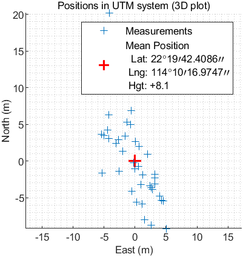

# AAE6102-Assignment-1
## Satellite Communication and Navigation (2024/25 Semester 2) - YANG Xiaoyu(24145927r)

## Task 1: Acquisition
The GPS signal acquisition process is structured into three distinct phases: initialization, initial acquisition, and precision refinement.

The result figures are shown as follows,

| Open Sky | Urban |
|:--------:|:-----:|
|    **Fig1:** Open Sky Acquisition Result|    **Fig2:** Urban Acquisition Result|
|    **Fig3:** In open sky dataset, satellite 16,22,26,27,31 can be acquired|    **Fig4:** In urban dataset, satellite 1,3,11,18 can be acquired|

## Task 2: Tracking
### 2.1 Open Sky

|          |       |
|:--------:|:-----:|
|    **Fig5:** Open Sky: Channel-1 PRN-16 |    **Fig6:** Open Sky: Channel-2 PRN-26|
|  **Fig7:** Open Sky: Channe5-1 PRN-27 |  **Fig8:** Open Sky: Channel-3 PRN-31 | 

Figures 5 to 8 illustrate the tracking results for satellites (PRN16, PRN26, PRN27, and PRN31) in an open sky environment:

- Scatter Plots: Dense and symmetric I/Q constellations indicate good signal quality and stable demodulation.
- Navigation Bits: Clear high/low transitions demonstrate reliable signal decoding without interruptions.
- Raw PLL Outputs: Stable amplitudes reflect effective phase tracking.
- Correlation Results: Well-separated Early, Prompt, and Late branches confirm strong signal acquisition.
- Raw DLL Outputs: Some noise is present, but amplitude variations remain within expected ranges.
- Filtered DLL Outputs: Smoother signals with reduced noise and fluctuations highlight effective filtering.

Overall, PRN16, PRN26, PRN27, and PRN31 exhibit excellent performance in open sky conditions, with stable DLL and PLL tracking and reliable signal processing.

<!-- |          |       |
|:--------:|:-----:|
|  | |
|  | | -->

### 2.2 Urban
|          |       |
|:--------:|:-----:|
|  **Fig9:** Open Sky: Channel-1 PRN-1|  **Fig10:** Open Sky: Channel-1 PRN-3|
|  **Fig11:** Open Sky: Channel-1 PRN-11 |  **Fig12:** Open Sky: Channel-4 PRN-18|

Analysis of Figures 9 to 12: Urban Environment Results
Compared to open sky, the urban tracking results show notable challenges:
- Scatter Plots: More compact constellations indicate stronger but constrained signals due to multipath effects.
- DLL Outputs: Higher amplitude variations and irregular patterns reflect multipath and signal reflections.
- PLL Outputs: Showing phase tracking issues from obstructions.
- Correlation Results: Greater variability and larger amplitude ranges highlight inconsistent signal tracking.

Urban environments increase signal variability and tracking instability, with PRN11 and PRN18 showing significant degradation due to multipath and obstructions.

<!-- |  |  |
|:--------:|:-----:|
|  | |
|  | | -->

### 2.3 Impact of Urban Interference
- Multipath Effects: Reflected signals cause constructive and destructive interference, leading to distorted correlation peaks.
- NLOS Receptions: Signals arriving via indirect paths introduce biases in the pseudorange measurements.
- Signal Attenuation: Buildings and other structures can attenuate the signal, reducing the signal-to-noise ratio (SNR) for satellites of Channel 3 and Channel 4.

### 2.4 Discussion
- In the open-sky environment, the DLL performs well with clear correlation peaks, allowing for accurate tracking.
- In the urban environment, the DLL performance degrades due to interference, resulting in less accurate and less stable tracking.
- Multiple correlators help in maintaining lock by providing a more robust estimate of the signal phase.

## Task 3: Navigation Data Decoding

## Task 4: Position and velocity estimation
### 4.1 Open Sky

    
       
    <strong>Fig. WSL-sky-enu.png</strong>

|  |  |
|:--------:|:-----:|
|    Fig1: Open Sky Acquisition Result|    Fig2: Urban Acquisition Result|

### 4.2 Urban

    
       
    <strong>Fig. WSL-urban-enu</strong>

|  |  |
|:--------:|:-----:|
|    Fig1: Open Sky Acquisition Result|    Fig2: Urban Acquisition Result|

## Task 5: Kalman-filter based positioning and velociy
### 5.1 Open Sky

    
       
    <strong>Fig. EKF-sky-enu</strong>

|  |  |
|:--------:|:-----:|
|    Fig1: Open Sky Acquisition Result|    Fig2: Urban Acquisition Result|

### 5.2 Urban

    
       
    <strong>Fig. EKF-urban-enu</strong>

|  |  |
|:--------:|:-----:|
|    Fig1: Open Sky Acquisition Result|    Fig2: Urban Acquisition Result|
